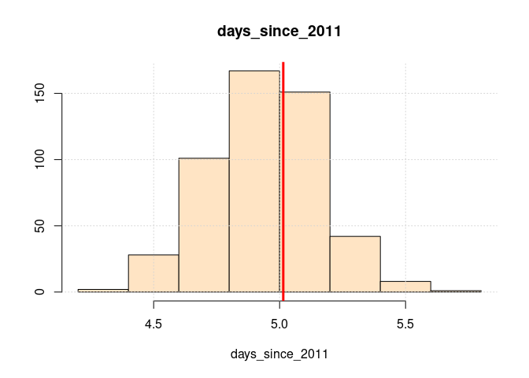
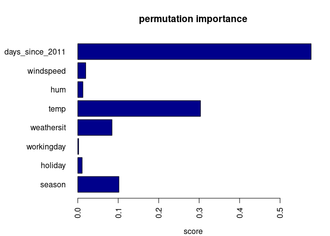

## Custom Functions  

```r
source("utils.R")
```

```
## Loading required package: viridisLite
```
# 1 Introductory Comments  
This assignment serves two purposes. First, it will train your modeling and data manipulation skills, in particular linear regression and summarizing data the `dplyr` way. Second, it reinforces your computational statistics (or: understanding statistics by simulation) competencies by comparing theoretical standard errors to those obtained by simulation. And as a bonus, you get to explore a cool data set and learn about *feature importance*.  
You should work in groups (ideally about 3 students per group). Each group must submit at least one R-file containing well-documented functions and test cases to test the functions. You may use two files (one for the functions and another one for the testcases), but this is not necessary. Write your answers and explanations as comments into the R-File. We strongly encourage you to submit an Rmd-file (plus its compiled version) instead of an R-File.  

This home assignment has 15 points (=15%) and is due Sunday, July 11, 6PM  
# 2 Data  
You need to download the [Bike Sharing Dataset](http://archive.ics.uci.edu/ml/datasets/Bike+Sharing+Dataset) from the UCI Machine Learning Repository http://archive.ics.uci.edu/ml/datasets/Bike+Sharing+Dataset , read in the *day.csv* data and preprocess your data as follows.  

```r
bikes <- read.csv("Bike-Sharing-Dataset/day.csv", stringsAsFactors = FALSE)
# bikes$days_since_2011 <- as.numeric(as.Date(bikes$dteday)-as.Date("2011-01-01"))
bike.features.of.interest <- c(
  "season", "holiday", "workingday", "weathersit", "temp", "hum", "windspeed", "days_since_2011", "cnt"
)
# colnames(bike)[c(1, 4, 6, 7, 8, 9, 10, 12)]

bikes <- clean.bike.data(bikes)[, bike.features.of.interest]
options(digits = 2)
# datatable(bikes[1:50, c(bike.features.of.interest, "cnt")])
kable(bikes[1:5, ])
```


|season |holiday    |workingday     |weathersit | temp| hum| windspeed| days_since_2011|  cnt|
|:------|:----------|:--------------|:----------|----:|---:|---------:|---------------:|----:|
|WINTER |NO HOLIDAY |NO WORKING DAY |MISTY      |  8.2|  81|        11|               0|  985|
|WINTER |NO HOLIDAY |NO WORKING DAY |MISTY      |  9.1|  70|        17|               1|  801|
|WINTER |NO HOLIDAY |WORKING DAY    |GOOD       |  1.2|  44|        17|               2| 1349|
|WINTER |NO HOLIDAY |WORKING DAY    |GOOD       |  1.4|  59|        11|               3| 1562|
|WINTER |NO HOLIDAY |WORKING DAY    |GOOD       |  2.7|  44|        13|               4| 1600|
Create a random subset of the data, which leaves a "hold out data set" for testing  

```r
set.seed(123)
nTrain <- round(nrow(bikes) / 2)
ranRows <- sample(nrow(bikes), nTrain)

train <- bikes[ranRows, ]
test <- bikes[-ranRows, ]
```
# 3 Data Summaries  

1. (**2 points**) Using `dplyr` (`group_by()` , `summarise()` ) and `ggplot2`:  
  - Compute the average bike rental counts as a function of  
    - `weathersit`  
    
    ```r
    # weathersit
    bikes %>%
      group_by(weathersit) %>%
      summarize(avg_rental = mean(cnt, na.rm = TRUE)) %>%
      kable()
    ```
    
    
    
    |weathersit      | avg_rental|
    |:---------------|----------:|
    |GOOD            |       4877|
    |MISTY           |       4036|
    |RAIN/SNOW/STORM |       1803|
    - `workingday`  
    
    ```r
    # workingday
    bikes %>%
      group_by(workingday) %>%
      summarize(avg_rental = mean(cnt, na.rm = TRUE)) %>%
      kable()
    ```
    
    
    
    |workingday     | avg_rental|
    |:--------------|----------:|
    |NO WORKING DAY |       4330|
    |WORKING DAY    |       4585|
    - all combinations of `weathersit` and `workingday`  
    
    ```r
    # all combinations of weathersit and workingday
    bikes %>%
      group_by(workingday, weathersit) %>%
      summarize(avg_rental = mean(cnt, na.rm = TRUE)) %>%
      kable()
    ## `summarise()` has grouped output by 'workingday'. You can override using the `.groups` argument.
    ```
    
    
    
    |workingday     |weathersit      | avg_rental|
    |:--------------|:---------------|----------:|
    |NO WORKING DAY |GOOD            |       4587|
    |NO WORKING DAY |MISTY           |       3937|
    |NO WORKING DAY |RAIN/SNOW/STORM |       1815|
    |WORKING DAY    |GOOD            |       5024|
    |WORKING DAY    |MISTY           |       4075|
    |WORKING DAY    |RAIN/SNOW/STORM |       1800|
2. (**2 points**) Repeat the above using the function `lm()` only.  

```r
# weathersit
lm_weathersit <- lm(cnt ~ weathersit, bikes)
summary(lm_weathersit) 
```

```
## 
## Call:
## lm(formula = cnt ~ weathersit, data = bikes)
## 
## Residuals:
##    Min     1Q Median     3Q    Max 
##  -4446  -1255    -15   1401   4326 
## 
## Coefficients:
##                           Estimate Std. Error t value Pr(>|t|)    
## (Intercept)                 4876.8       85.6   56.99  < 2e-16 ***
## weathersitMISTY             -840.9      145.1   -5.80  1.0e-08 ***
## weathersitRAIN/SNOW/STORM  -3073.5      410.8   -7.48  2.1e-13 ***
## ---
## Signif. codes:  0 '***' 0.001 '**' 0.01 '*' 0.05 '.' 0.1 ' ' 1
## 
## Residual standard error: 1840 on 728 degrees of freedom
## Multiple R-squared:  0.0992,	Adjusted R-squared:  0.0967 
## F-statistic: 40.1 on 2 and 728 DF,  p-value: <2e-16
```

```r
# the intercept equals the average rental for weathersit = 1
# adding the other two coefficient to the intercept gives the average
# for weathersit 2 and 3 respectively

tmp_weathersit_2 <- lm_weathersit$coefficients[1] + lm_weathersit$coefficients[2]
names(tmp_weathersit_2) <- "weathersit 2"
tmp_weathersit_3 <- lm_weathersit$coefficients[1] + lm_weathersit$coefficients[3]
names(tmp_weathersit_3) <- "weathersit 3"
kable(c(tmp_weathersit_2, tmp_weathersit_3), col.names = "avg rentals")
```


|             | avg rentals|
|:------------|-----------:|
|weathersit 2 |        4036|
|weathersit 3 |        1803|

```r
# workingday
lm_workingday <- lm(cnt ~ workingday, bikes)
summary(lm_workingday)
```

```
## 
## Call:
## lm(formula = cnt ~ workingday, data = bikes)
## 
## Residuals:
##    Min     1Q Median     3Q    Max 
##  -4563  -1358      4   1484   4384 
## 
## Coefficients:
##                       Estimate Std. Error t value Pr(>|t|)    
## (Intercept)               4330        127   34.01   <2e-16 ***
## workingdayWORKING DAY      255        154    1.65    0.098 .  
## ---
## Signif. codes:  0 '***' 0.001 '**' 0.01 '*' 0.05 '.' 0.1 ' ' 1
## 
## Residual standard error: 1930 on 729 degrees of freedom
## Multiple R-squared:  0.00374,	Adjusted R-squared:  0.00237 
## F-statistic: 2.74 on 1 and 729 DF,  p-value: 0.0985
```

```r
tmp_workingday <- lm_workingday$coefficients[1] + abs(lm_workingday$coefficients[2])
names(tmp_workingday) <- "workingday"
kable(tmp_workingday, col.names = "avg rentals")
```


|           | avg rentals|
|:----------|-----------:|
|workingday |        4585|

```r
# all combinations of weathersit and workingday

lm_work_weather <- lm(cnt ~ workingday:weathersit, bikes)
summary(lm_work_weather)
```

```
## 
## Call:
## lm(formula = cnt ~ workingday:weathersit, data = bikes)
## 
## Residuals:
##    Min     1Q Median     3Q    Max 
##  -4593  -1219    -56   1418   4287 
## 
## Coefficients: (1 not defined because of singularities)
##                                                    Estimate Std. Error t value
## (Intercept)                                          1799.5      459.3    3.92
## workingdayNO WORKING DAY:weathersitGOOD              2787.8      482.3    5.78
## workingdayWORKING DAY:weathersitGOOD                 3224.4      471.1    6.84
## workingdayNO WORKING DAY:weathersitMISTY             2137.3      509.1    4.20
## workingdayWORKING DAY:weathersitMISTY                2275.5      479.6    4.74
## workingdayNO WORKING DAY:weathersitRAIN/SNOW/STORM     15.9      941.3    0.02
## workingdayWORKING DAY:weathersitRAIN/SNOW/STORM          NA         NA      NA
##                                                    Pr(>|t|)    
## (Intercept)                                         9.8e-05 ***
## workingdayNO WORKING DAY:weathersitGOOD             1.1e-08 ***
## workingdayWORKING DAY:weathersitGOOD                1.6e-11 ***
## workingdayNO WORKING DAY:weathersitMISTY            3.0e-05 ***
## workingdayWORKING DAY:weathersitMISTY               2.5e-06 ***
## workingdayNO WORKING DAY:weathersitRAIN/SNOW/STORM     0.99    
## workingdayWORKING DAY:weathersitRAIN/SNOW/STORM          NA    
## ---
## Signif. codes:  0 '***' 0.001 '**' 0.01 '*' 0.05 '.' 0.1 ' ' 1
## 
## Residual standard error: 1840 on 725 degrees of freedom
## Multiple R-squared:  0.107,	Adjusted R-squared:  0.101 
## F-statistic: 17.3 on 5 and 725 DF,  p-value: 3.24e-16
```

```r
# intercept value is avg bike rentals for workingday = 1 and weathersit = 3
# adding the coefficients gives the avg rentals for every combination of weather and workingday

coeffs <- c(lm_work_weather$coefficients[2:6])
kable(lm_work_weather$coefficients[1] + coeffs, col.names = "avg rentals")
```


|                                                   | avg rentals|
|:--------------------------------------------------|-----------:|
|workingdayNO WORKING DAY:weathersitGOOD            |        4587|
|workingdayWORKING DAY:weathersitGOOD               |        5024|
|workingdayNO WORKING DAY:weathersitMISTY           |        3937|
|workingdayWORKING DAY:weathersitMISTY              |        4075|
|workingdayNO WORKING DAY:weathersitRAIN/SNOW/STORM |        1815|
# 4 Standard Errors in Linear Regression  
In this example, we use the linear regression model to predict the number of rented bikes on a particular day, given weather and calendar information. For the interpretation, we examine the estimated regression weights. The features consist of numerical and categorical features. For each feature, the table shows the estimated weight, the standard error of the estimate (SE), and the absolute value of the t-statistic (|t|).  

```r
# data(bike)

mod <- lm(cnt ~ ., data = train, x = TRUE)
lm_summary <- summary(mod)$coefficients

lm_summary[, 't value'] <- abs(lm_summary[, 't value'])
rownames(lm_summary) <- pretty_rownames(rownames(lm_summary))

kable(lm_summary[, c('Estimate', 'Std. Error', 't value')], digits = 1, col.names = c('Weight', 'SE', "|t|"))
```


|                          | Weight|    SE| &#124;t&#124;|
|:-------------------------|------:|-----:|-------------:|
|(Intercept)               |   2192| 319.1|           6.9|
|seasonSPRING              |   1182| 166.0|           7.1|
|seasonSUMMER              |    629| 219.0|           2.9|
|seasonFALL                |    534| 153.2|           3.5|
|holidayHOLIDAY            |   -544| 337.5|           1.6|
|workingdayWORKING DAY     |    179|  97.9|           1.8|
|weathersitMISTY           |   -410| 115.3|           3.6|
|weathersitRAIN/SNOW/STORM |  -2148| 302.8|           7.1|
|temp                      |     84|   9.3|           9.0|
|hum                       |    -12|   4.1|           2.8|
|windspeed                 |    -42|   9.4|           4.5|
|days_since_2011           |      5|   0.2|          21.1|
The information of the weight table (weight and variance estimates) can be visualized in a weight plot. The following plot shows the results from the previous linear regression model.  

```r
coef_plot(mod) + scale_y_discrete("")
```


# 4.1 Tasks  

1. (**1 point**) Predict the number of rented bikes for rows $1$ and $150$ of the test data  

|season |holiday    |workingday     |weathersit | temp| hum| windspeed| days_since_2011|
|:------|:----------|:--------------|:----------|----:|---:|---------:|---------------:|
|WINTER |NO HOLIDAY |NO WORKING DAY |MISTY      |  8.2|  81|        11|               0|
|FALL   |NO HOLIDAY |WORKING DAY    |GOOD       | 14.4|  64|        28|             292|

```r
rented_bikes_mx <- matrix(NA, 2, 2, dimnames = list(c("row 1", "row 150"), c("bikes", "SD")))
#Prediction of Row 1
rented_bikes_1 <- round(predict(mod, test[1, ]), 4)
rented_bikes_mx[1, 1] <- names(rented_bikes_1)
rented_bikes_mx[1, 2] <- rented_bikes_1
#Prediction of Row 150
rented_bikes_150 <- round(predict(mod, test[150, ]), 4)
rented_bikes_mx[2, 1] <- names(rented_bikes_150)
rented_bikes_mx[2, 2] <- rented_bikes_150

kable(rented_bikes_mx)
```


|        |bikes |SD        |
|:-------|:-----|:---------|
|row 1   |1     |1081.3942 |
|row 150 |293   |3641.658  |
2. (**6 points**) The “standard errors” of the coefficients quantify the uncertainty of the estimated coefficients. Write two functions:  

  - **simCoefs** simulates the process of repeatedly ($M=500$) fitting a linear model to random subsets of your data of size 366 and stores the estimated slopes in a matrix,  
    
    ```r
    simCoefs <- function(data = bikes, nTrain, lm_summary, M = 500){
      # data$weathersit <- as.integer(data$weathersit)
      coefs <- matrix(NA, ncol = nrow(lm_summary),nrow = M)
      colnames(coefs) <- rownames(lm_summary)
      for (i in 1:M) {
        df <- data[sample(nrow(data), nTrain), ]
        fit <- lm(cnt ~ ., data = df)
        input <- coef(fit)
        coefs[i, ] <- input
      }
      return(coefs)
    }
    ```
  - **visCoefs** draws histograms of the obtained coefficient estimates, adds vertical lines at the corresponding estimates from *lm_summary* and computes summary statistics. You can choose between base R graphics (example shown below) and ggplot.  
    
    ```r
    visCoefs <- function(coefs, lm_summary){
      ms <- matrix(NA, ncol = ncol(coefs), nrow = 2, dimnames = list(c("mean", "stdev"), colnames(coefs)))
      for (i in 1:ncol(coefs)) {
        ms[1, i] <- mean(coefs[, i])
        ms[2, i] <- sd(coefs[, i])
      }      
      coefsdf <- as.data.frame(coefs)
    
        for (col in 1:ncol(coefsdf)) {
            hist(coefsdf[, col], main = names(coefsdf[col]), col = "bisque", xlab = names(coefsdf[col]), ylab = "")
            grid()
            abline(v = lm_summary[col], col = "red", lwd = 3)
        }
      # m <- ms[1, ]
      # s <- ms[2, ]
      # return(list(mean = m, stdev = s))
      return(ms)
    }
    ```
Comment on the agreement with the estimated *standard errors*.

```r
coefs <- simCoefs(data = bikes, lm_summary = lm_summary, nTrain = nTrain, 500)
ms <- visCoefs(coefs, lm_summary)
```



```r
# row.names can be turned on
kable(ms, row.names = FALSE)
```


| (Intercept)| seasonSPRING| seasonSUMMER| seasonFALL| holidayHOLIDAY| workingdayWORKING DAY| weathersitMISTY| weathersitRAIN/SNOW/STORM|  temp| hum| windspeed| days_since_2011|
|-----------:|------------:|------------:|----------:|--------------:|---------------------:|---------------:|-------------------------:|-----:|---:|---------:|---------------:|
|        2385|          890|          132|        420|           -689|                   127|            -386|                     -1909| 111.0| -17|     -42.0|            4.94|
|         238|          126|          171|        125|            294|                    86|              82|                       271|   8.2|   3|       7.8|            0.22|

# 5 Permutation Importance  
This task will introduce you the concept of measuring the importance of features by randomly shuffling each column and measuring the drop in prediction accuracy.  
The concept is really straightforward: We measure the importance of a feature by calculating the increase in the model’s prediction error after permuting the feature. A feature is “important” if shuffling its values increases the model error, because in this case the model relied on the feature for the prediction. A feature is “unimportant” if shuffling its values leaves the model error unchanged, because in this case the model ignored the feature for the prediction.  
In particular:  
Record a baseline accuracy (classifier) or $R^{2}$ score (regressor) by passing a validation set through the model. Permute the column values of a single predictor feature and then pass all test samples back through the Random Forest and recompute the accuracy or $R^{2}$. The importance of that feature is the difference between the baseline and the drop in overall accuracy or $R^{2}$ caused by permuting the column.  

1. (**4 points**) Write a function which computes this *permutation importance* using the test set that we created earlier.  

```r
calc.rsq <- function(y, mod, dat = test){
  rss <- sum(
    (y - predict(mod, newdata = dat))^2, na.rm = TRUE
  )
  tss <- (nrow(dat) - 1) * var(y, na.rm = TRUE)
  return(1 - rss / tss)
}

permImp <- function(mod, dat = test){
  p <- ncol(dat)
  impScores <- rep(NA, p - 1)
  names(impScores) <- colnames(dat)[1:(p - 1)]
  Y <- dat[, p]
  Base.rsq <- calc.rsq(y = Y, mod = mod)
  
  for (i in 1:(p - 1)) {
    dat.temp <- dat
    dat.temp[, i] <- sample(dat[, i])
    impScores[i] <- Base.rsq - calc.rsq(y = Y, mod = mod, dat = dat.temp)
  }
  
  return(impScores)
}

set.seed(321)
impScores <- permImp(mod, test)
par(mar = c(4, 8, 4, 2))
barplot(impScores, horiz = TRUE, col = "darkblue", xlab = "score", main = "permutation importance", las = 2)
```

<!-- -->

